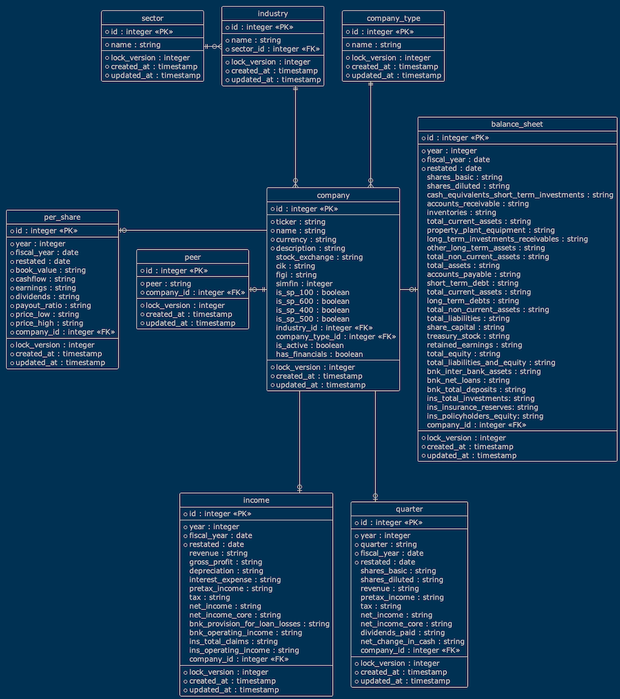

# Stocks


## Introduction

Builds a database containing historical financial data for components of the S&P 600, 500 & 400 indexes.  This database
is provided for educational and private use, it should not be relied upon in any why to support the making of 
investment decisions.  **The provider accepts no responsibility whatsoever for its accuracy or suitability for purpose,
so use and abuse at your own risk.**

## Entity Model



The database has many supporting tables whose names begin with z_ or zs_ and are not documented here as they are only
used to build the final tables.

In addition to this there are a series of audit tables used to track changes to the main tables.  These tables names
begin with xxx_ and are not documented here either as they are primarily intended for debugging and tracking.

## Usage

The first step it to create the database, to do this you have two options:

- First create a database named stocks and provide an account to work with it with the user name: stocks-dev and a password: Stocks-Dev*123.
- Alternatively create a database of your choice and associated account, then update the credentials in the ini file: build_database/alembic.ini

Once you have done this, navigate to the folder: stocks/build_database in the terminal and execute the command to update
the schema:

```
alembic upgrade head
```

Once the database has been created, you can run the loader from the root folder with the following commands:

To import the data:

```
python loader import
```

To stage the data:

```
python loader stage
```

And finally, to complete the process:

```
python loader publish
```
