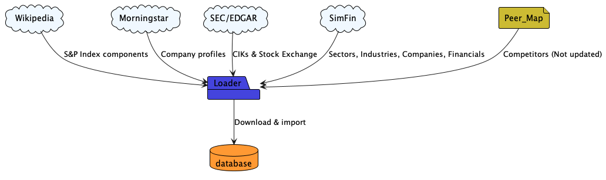

# Stocks


## Introduction

This application builds a database containing historical financial data for the components of the S&P 600, 500 & 400 
indexes.  This database is provided for educational and private use, it should not be relied upon in any why to support 
the making of investment decisions.  **The provider accepts no responsibility whatsoever for its accuracy or suitability 
for purpose, so use and abuse at your own risk.**

## Data Sources

The application uses a number of sources to build the final database:



In order to use these data sources you will need to register and obtain API keys for the following data sources:

| Source           | URL                                                    |
|------------------|--------------------------------------------------------|
| OpenFIGI Website | [https://www.openfigi.com/](https://www.openfigi.com/) |
| SimFin Website   | [https://simfin.com/](https://simfin.com/)             |

## Entity Model


The database has many supporting tables whose names begin with z_ or zs_ and are not documented here as they are only
used to build the final tables.  In addition to this there are a series of audit tables used to track changes to the 
main tables.  These tables names begin with xxx_ and are not documented here either as they are primarily intended for 
debugging and tracking.

## Usage

The first step is it to create the MySQL database, to do this you have two options:

- First create a database named stocks and provide an account to work with it using the username: stocks-dev and a password: Stocks-Dev*123.
- Alternatively create a database of your choice and associated account, then update the credentials in the ini file: build_database/alembic.ini

Once you have done this, navigate to the folder: stocks/build_database in the terminal and execute the command to update
the schema:

```
alembic upgrade head
```

Once the database has been created, the next step it to configure the loader with the database credentials and the API
key values.  Once you have activated your virtual environment in the terminal, execute the follow command and follow 
the online prompts to complete the process:

```
python loader config
```

Once the loader has been configured you can begin the process to build the database by executing the following command
to import the data:

```
python loader import
```

Once the data has been imported you can stage the master data by executing this commandT:

```
python loader stage
```

And finally, to complete the process and publish the data:

```
python loader publish
```

As it takes some time to build this database, it is advisable to make a backup copy of the database before using it.
